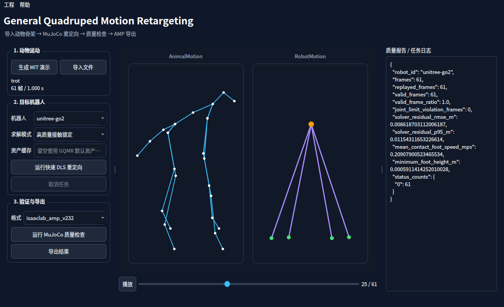

# GQMR
General Quadruped Motion Retargeting



项目统一使用 MuJoCo 作为运动学、动力学、仿真和渲染后端，不使用 PyBullet。

项目的完整实施路线见 [GQMR 四足快速运动重定向工具实施计划](docs/IMPLEMENTATION_PLAN.md)。

当前已实现 Motion Schema v1、安全 NPZ I/O、可信机器人资产、dog-27 输入、多机型快速与高质量重定向、MuJoCo 回放、AMP/DeepMimic 导出、`.gqmr` 工程、PySide6 GUI、流式录制、通用/DLC/SLEAP 姿态文件和多目三角化。内置支持 Unitree Go2/Go1/A1/A2/B2、ANYmal C 和云深处 Lite3。实际完成度、验证结果与已知问题见 [实施状态](docs/IMPLEMENTATION_STATUS.md)。

GUI 会直接渲染七种内置机器人的 MuJoCo mesh，并随时间轴更新机器人姿态；在模型区域拖动可旋转视角，滚轮可缩放。

## 启动与使用

使用已提交的锁文件安装。仓库 `assets/` 已包含七种内置机器人的完整 MuJoCo 模型和 mesh，无需首次下载：

```bash
uv sync --frozen --extra test
uv run gqmr --version
uv run gqmr assets status
uv run gqmr gui
```

GUI 的“动作测试集”提供 8 个固定、可复现动作：慢速/标准行走，慢速/标准/快速小跑，侧对步以及左右转。选择任意动作和内置机器人后点击“生成所选动作”与“开始重定向”；也可点击“批量评估泛化性能”，运行当前机器人或全部机器人 × 全部动作，并统一报告有效帧率、求解残差、关节限位、自碰撞、穿地和接触滑移。

“导入动作”支持标准 AnimalMotion NPZ、旧版 dog-27 TXT，以及已经标定到 GQMR 世界坐标系的 3D 通用 keypoint JSON/NPZ/CSV。DeepLabCut/SLEAP 的 2D CSV 与多目三角化可通过 `gqmr pose` 命令转换后导入。

犬类视频姿态 MVP 已提供增量视频解码和可选推理后端入口：

```bash
gqmr pose backends
gqmr pose video dog.mp4 --backend dog-mmpose \
  --config dog-mmpose.json --batch-size 16 --output dog.2d.npz
```

MMPose 犬类/animal 2D 后端位于 `plugins/gqmr-dog-mmpose`，需按 GPU/CUDA 环境独立安装。它保留原视频 PTS，并记录视频、模型配置和推理批次的可追溯元数据。当前输出为模型原生 2D 动物关键点，不宣称已完成单目 3D；实施边界与下一阶段见 [`VIDEO_DOG_POSE_MVP.md`](docs/VIDEO_DOG_POSE_MVP.md)。

默认资产根目录是仓库根目录，完整模型位于 `GQMR/assets/<asset_id>/<commit>/`。如果机器人区域提示资产不可用，执行 `gqmr assets status`检查逐文件哈希。自定义位置使用 `--asset-root`；旧的 `--cache-dir` 参数仅作兼容别名保留。

最短演示闭环：

```bash
uv run gqmr synthetic trot --duration 2 --output trot.animal.npz
uv run gqmr retarget trot.animal.npz --robot unitree-go2 \
  --mode high-quality --output trot.go2.npz
uv run gqmr play trot.go2.npz --robot unitree-go2 --dynamics
uv run gqmr export trot.go2.npz --robot unitree-go2 \
  --format isaaclab_amp_v232 --output trot.amp.npz
uv run gqmr gui
```

仓库中的 [`examples/demo`](examples/demo) 包含由 MIT 合成 trot 生成的 AnimalMotion、Go2 RobotMotion、Isaac Lab AMP、DeepMimic JSON、质量报告和 portable `.gqmr` 工程，不包含历史 CC BY-NC 动作。

开发验证：

```bash
env -u PYTHONPATH QT_QPA_PLATFORM=offscreen MUJOCO_GL=egl \
  uv run --frozen pytest -q
PYTHONPATH=src python3 -m gqmr.cli.main --version
PYTHONPATH=src python3 -m gqmr.cli.main validate motion.robot.npz \
  --model-sha256 <sha256>
PYTHONPATH=src python3 -m gqmr robots inspect unitree-go2
PYTHONPATH=src python3 -m gqmr validate motion.robot.npz --robot unitree-go2
```

当前阶段不启用 CI/CD，仓库中的自动流水线配置已移除；发布前按
[实施状态](docs/IMPLEMENTATION_STATUS.md)记录的冻结环境、本地构建、包扫描和干净环境演示步骤验收。
本轮可展示流程和量化结果见 [展示与验收说明](docs/DEMO_ACCEPTANCE.md)。

真实动物第三方动作不进入 Git。运行 `./tools/install_external_motion_data.sh` 可把本地已有的
AI4Animation 犬类动捕整理到被忽略的 `external_data/`，PFERD、RGBD-Dog 和 AcinoSet
的官方链接、许可限制与目录约定见 [本地第三方动作数据](docs/EXTERNAL_MOTION_DATASETS.md)。

Unitree 资产命令：

```bash
PYTHONPATH=src python -m gqmr assets status
PYTHONPATH=src python -m gqmr assets pack unitree-go2 go2.gqmr-assets
PYTHONPATH=src python -m gqmr assets unpack go2.gqmr-assets --asset-root /path/to/root
```

`assets install` 仍保留，用于修复损坏资产或将资产安装到其他根目录。
